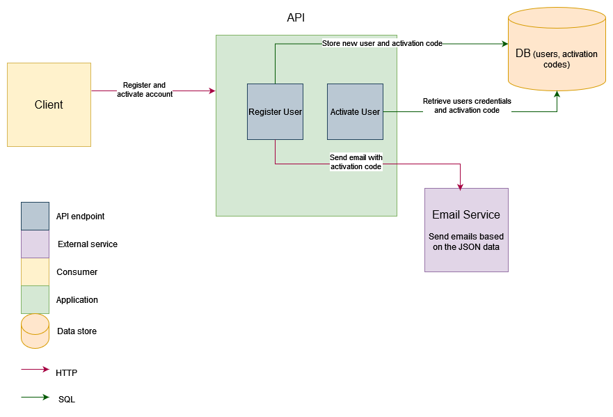

# Introduction

This is a simple example of a FastAPI application with user registration and user activation.
It doesn't use any ORM and can be deployed as Docker container.

It provides two routes.

 - `POST /users/`: register a new user. The user is not activated yet.
 - `POST /users/me/activate/`: activate the user. The user must be authenticated.

A `/health` route is also available and used as a healthcheck in the docker compose.

All routes are fully documented with examples in the Swagger UI, available at http://localhost:8080/docs.



## Notes

I didn't know if sqlalchemy core (without the ORM) would be considered as "magic",
so I used [`aiomysql`](https://aiomysql.readthedocs.io) directly. As a result, because of time constraints,
the database operations are not as abstracted as I would have liked. It also makes
the testing code more complex.

A fake email service is installed in the docker compose. It provides three routes:

 - `POST /email`: prints the email content to the standard output
 - `POST /email/error`: return an HTTP 500 error
 - `POST /email/timeout`: same as `/email`, but waits 10 seconds before returning

When the email service is unavailable, the user registration is rolled back.

For simplicity of use, the app itself will also display the email body to the standard output.

Logs are written on stdout, formatted as JSON. A `request_id` field is added for each request,
and can be used to trace the logs of a single request. A middleware will log each request with its status code,
method and path.

The application is configured through environment variables, and the default values are set in `.sample.env`.

Using a `VARCHAR(36)` to store UUIDs is not efficient with InnoDB. I realized that too late because I'm used to
PostgreSQL, which provides a native `UUID` type.
See https://blogs.oracle.com/mysql/post/mysql-uuids for details.

I chose to include the database calls in "unit" tests, but they mock the email service calls.
Integration tests call the email service. The test coverage is 100%.

I tried to run the tests in the CI with GitHub Actions, but couldn't figure out quickly how to run the email service
after building it.


# Running with docker

The application port will be exposed on the host at port 8080.

```bash
cp .sample.env .env
docker compose run init-db  # create the database and the tables
docker compose up app
```

The `init-db` takes about 30s seconds to run on my machine, because it depends on the `db` (mysql server) container,
whose startup is slow. While I expect my healthcheck settings to be sufficient to ensure that the database is ready
even if the service were to take much more time to slow, if it fails, you can run it again. The `db` container will
have started by then.

The mysql database is stored in a persistent docker volume. To clean it, you can run

```bash
docker compose down -v
```

If you have run tests before, you should also remove the `tests` containers and volumes/network:

```bash
docker compose --profile test down -v
```

Otherwise running tests will fail because not all networks have been deleted.


## Testing

With the app running, you can register a user with

```bash
curl -X POST -H "Content-Type: application/json" http://localhost:8080/users/  \
  -d  '{"email": "example@example.com", "password": "password"}'
```

The activation code is printed on the stdout of the app container. You can activate the user with

```bash
curl -X POST -H "Content-Type: application/json" http://localhost:8080/users/me/activate/  \
  -u "example@example.com:password" \
  -d  '{"code": "1234"}'
````

You can also use the Swagger UI to run the requests. It is available at http://localhost:8080/docs.

Tests can be run with docker compose:

```bash
docker compose run tests
```

The container `tests` will mount the source code and the tests as volumes, so that they can be run without building
the container each time.

The `run tests` command will take some time because mysql takes some time to startup. You can run this before `run tests`
if you need to run them several times:

```bash
docker compose up test-db -d
```

# Development

## Development environment

Create a virtualenvironment and install the dependencies:

```bash
python -m venv .venv
. .venv/bin/activate
pip install pip-tools
pip install -r requirements-dev.txt
```


## Dependencies management

The project uses [`pip-tools`](https://github.com/jazzband/pip-tools) to generate the pinned dependencies in `requirements.txt` and `requirements-dev.txt`.

To add a new dependency, add it in `pyproject.toml` then run

```bash
pip-compile --output-file=requirements.txt --generate-hashes pyproject.toml
```

Development dependencies are specified in `requirements-dev.in`. To generate `requirements-dev.txt`, run

```bash
pip-compile --output-file=requirements-dev.txt --generate-hashes requirements-dev.in
```

`pip-tools` also provides the `pip-sync` command, which ensures that only the dependencies listed in the requirements
files are installed in the virtual environment. It will uninstall non-listed libraries:

```bash
pip-sync requirements-dev.txt
```

## Linting and pre-commit

The project uses [`pre-commit`](https://pre-commit.com/) to run linters and code formatters before each commit.
The following linters are set up:

 - `ruff`: linter and formatter
 - `hadolint`: Dockerfile linter
